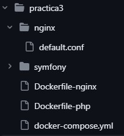

# DESPLIEGUE

En esta práctica utilizaremos Symfony para dockerizarla y usarla como network, donde gracias a docker-compose podremos tener 3 contenededores: php, nginx y mysql.

##NGINX

Tenemos una carpeta llamada nginx con una configuración llamada __default.conf__ con la siguiente configuración:

```
default.conf: server {
    listen 80;
    root /var/www/symfony/public;

    location / {
        try_files $uri /index.php$is_args$args;
    }
    location ~ ^/index\.php(/|$) {
        # Connect to the Docker service using fpm
        fastcgi_pass php:9000;
        fastcgi_split_path_info ^(.+\.php)(/.*)$;
        include fastcgi_params;
        fastcgi_param SCRIPT_FILENAME $realpath_root$fastcgi_script_name;
        fastcgi_param DOCUMENT_ROOT $realpath_root;
        internal;
    }
    location ~ \.php$ {
        return 404;
    }
    error_log /dev/stdout info;
    access_log /var/log/nginx/project_access.log;
}

```

Y fuera de la carpeta tenemos nuestro __Dockerfile-nginx__ con la siguiente configuración:

```
FROM nginx:latest

COPY ./nginx/default.conf /etc/nginx/conf.d/

```

##PHP

Tenemos un __Dockerfile-php__ con la siguiente configuración:

```
FROM php:8.2-fpm

RUN apt-get update && apt-get install -y

RUN apt-get update && apt-get install -y \
        git \
        zlib1g-dev \
        libxml2-dev \
        libzip-dev \
    && docker-php-ext-install \
        zip \
        intl \
		mysqli \
        pdo pdo_mysql
    
RUN curl -sS https://getcomposer.org/installer | php && mv composer.phar /usr/local/bin/composer
RUN curl -sS https://get.symfony.com/cli/installer | bash
RUN mv /root/.symfony5/bin/symfony /usr/local/bin/symfony

RUN git config --global user.email "antoniomleonjimenez@gmail.com"
RUN git config --global user.name "AntonioMLeon"

RUN symfony check:requirements

COPY symfony/ /var/www/symfony
WORKDIR /var/www/symfony/

```
##Docker-compose

Nuestro __Docker-compose__ se verá de la siguiente forma:

```
version: '3'

services:
    nginx:
      build:
        context: .
        dockerfile: Dockerfile-nginx
      volumes:
          - ./symfony/:/var/www/symfony/
      ports:
        - 8080:80
      networks:
        - symfony
    php:
      build:
        context: .
        dockerfile: Dockerfile-php
      volumes:
           - ./symfony/:/var/www/symfony/
      networks:
        - symfony
      depends_on:
        - mysql
    mysql:
      image: mysql
      ports:
        - 3310:3306
      volumes:
        - ./mysql:/var/lib/mysql
      networks:
        - symfony
networks:
  symfony:

```
Una vez hecho todo lo anterior la distribución de nuestros archivos y carpetas se verá de la siguiente forma:



